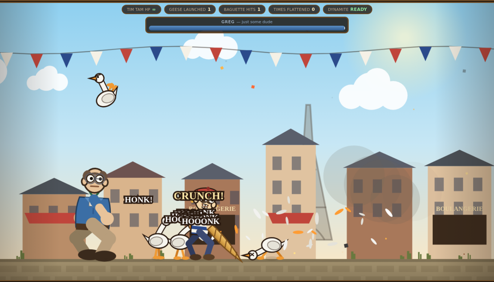

# 🥖 The Adventures of Tim Tam

**A derpy baker. One overpowered baguette. A final boss named Greg.**

▶ **[Play it in your browser](https://sheppio.github.io/the-adventures-of-tim-tam/)**



---

## Why this exists

Every publisher on earth cleared out of the way of GTA VI's release date.

This one is aimed directly at it.

I'm not a game dev. I just thought it would be the single funniest thing in
the industry if a game about a man slapping geese with a piece of bread
launched head-to-head with the most expensive entertainment product ever made.
So the idea is here, it works, it's MIT licensed, and the title screen has a
countdown to **November 19, 2026** on it.

Somebody please run with it.

## The game

One arena. Side-scrolling. No levels, no lore, no menus to speak of.

- **Tim Tam** — a baker with a beret, two enormous front teeth, and eyes that
  point in slightly different directions.
- **The baguette** — swings in a wide arc and launches a goose roughly a
  thousand pixels into the sky. It is not balanced. It was never going to be.
- **The dynamite** — comically powerful, on a short cooldown, and Tim Tam is
  emphatically included in his own blast radius.
- **Geese** — they honk, they waddle, they charge, they extend their necks at
  you in a way that is genuinely upsetting.
- **Greg** — the final boss. Just some dude named Greg. Polo shirt, khakis,
  lanyard. He throws staplers and calls meetings.
- **Random explosions** — go off every few seconds for no reason at all,
  somewhere on screen, and knock everybody over. This is a feature.

### Tim Tam cannot die

There is no health bar. There is no death animation, because nobody wrote one.

Hit him hard enough and the puppet strings are cut: he goes fully limp, tumbles
wherever the physics sends him, lands, wobbles back upright over about half a
second, and immediately resumes slapping. The scoreboard counts **times
flattened**, not deaths. The victory screen reports his death count as
`0 (not implemented)`.

## Controls

| Action | Keyboard | Mouse | Touch |
| --- | --- | --- | --- |
| Waddle | <kbd>A</kbd> / <kbd>D</kbd> or arrows | — | ◀ ▶ |
| Hop | <kbd>W</kbd> / <kbd>Space</kbd> | — | ▲ |
| Swing baguette | <kbd>J</kbd> | left click | 🥖 |
| Throw dynamite | <kbd>K</kbd> / <kbd>E</kbd> | right click | 🧨 |
| Restart arena | <kbd>R</kbd> | — | — |
| Mute | <kbd>M</kbd> | — | 🔊 button |

## Running it locally

No build step, no dependencies, no bundler. It's ES modules and a canvas.
It does need to be served over HTTP (modules won't load from `file://`):

```sh
git clone https://github.com/Sheppio/the-adventures-of-tim-tam.git
cd the-adventures-of-tim-tam
python3 -m http.server 8000
# open http://localhost:8000
```

## How it's built

Plain JavaScript, one `<canvas>`, zero dependencies, zero asset files. Every
character is drawn with vector calls and every sound is synthesised at runtime
with the Web Audio API, so the whole game is a handful of kilobytes of text.

```
index.html          page shell, HUD, title and victory screens
src/config.js       every tunable number in the game
src/physics.js      Verlet particles, distance constraints, blast impulses
src/ragdoll.js      humanoid ragdoll that can also, reluctantly, walk
src/hero.js         Tim Tam: swinging, throwing, flopping, getting back up
src/goose.js        geese
src/greg.js         Greg
src/fx.js           explosions, feathers, screen shake, floating insults
src/render.js       all the drawing
src/audio.js        synthesised thwacks, honks and booms
src/input.js        keyboard, mouse, touch
src/main.js         the world, the game loop, the collisions
```

### The ragdoll

Everyone in the game is the same rig: point masses joined by distance
constraints, integrated with Verlet.

The trick that makes it walkable is that while a character is conscious, the
hips are *rooted* — driven by velocity control, and protected from the
constraint solver's sideways corrections — while every other body part just
dangles off them on springs. That's what gives the wobbly, top-heavy,
slightly-drunk look while still letting you steer.

Knock someone down and the drive value drops to zero. Nothing else changes.
The exact same rig that was walking a frame ago is now a bag of limbs, because
the puppeteer let go. Getting up just ramps the drive value back to one.

There is no separate "death" code path anywhere in this repository.

### Tuning it

Everything absurd lives in `src/config.js`. `BAGUETTE.knockback`,
`DYNAMITE.force`, `RANDOM_BOOM.minDelay`. Turn them up. That's the whole
point.

## Contributing

Please do. Ideas that are wide open:

- more geese behaviours (formation flying, a goose that steals the baguette)
- a second boss who is also just some dude
- co-op, so two Tim Tams can flatten each other
- proper music, ideally an accordion
- actually shipping this on November 19, 2026

## Licence

MIT — see [LICENSE](LICENSE). Take it, fork it, sell it, ship it. Just please
ship it on the right day.

## Version

The build number is shown on the title screen. It lives in `VERSION` in
[`src/config.js`](src/config.js) — bump it on every push. History in
[CHANGELOG.md](CHANGELOG.md).
